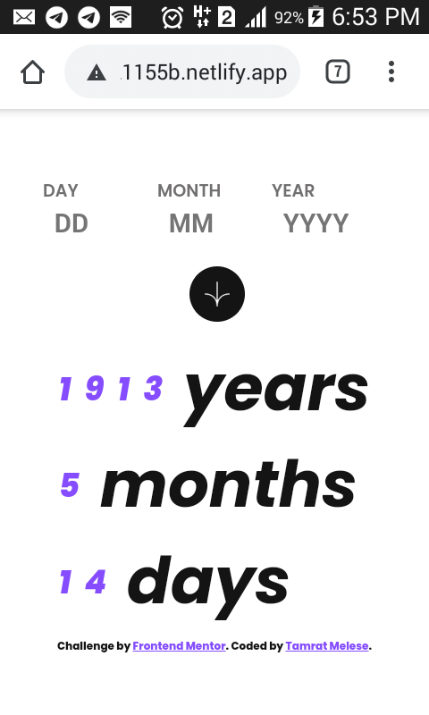

# Frontend Mentor - Age calculator app solution

This is a solution to the [Age calculator app challenge on Frontend Mentor](https://www.frontendmentor.io/challenges/age-calculator-app-dF9DFFpj-Q). Frontend Mentor challenges help you improve your coding skills by building realistic projects.

## Table of contents

- [Overview](#overview)
  - [The challenge](#the-challenge)
  - [Screenshot](#screenshot)
  - [Links](#links)
- [My process](#my-process)
  - [Built with](#built-with)
  - [What I learned](#what-i-learned)
  - [Continued development](#continued-development)
  - [Useful resources](#useful-resources)
- [Author](#author)
- [Acknowledgments](#acknowledgments)

## Overview

### The challenge

Users should be able to:

- View an age in years, months, and days after submitting a valid date through the form
- Receive validation errors if:
  - Any field is empty when the form is submitted
  - The day number is not between 1-31
  - The month number is not between 1-12
  - The year is in the future
  - The date is invalid e.g. 31/04/1991 (there are 30 days in April)
- View the optimal layout for the interface depending on their device's screen size
- See hover and focus states for all interactive elements on the page
- **Bonus**: See the age numbers animate to their final number when the form is submitted

### Screenshot

;
;
;
;
;

### Links

- Live Site URL: [https://66a26eb458937e4838286c55--simpleagecalculator-tamratmade.netlify.app/]

## My process

### Built with

- Semantic HTML5 markup
- CSS custom properties
- Flexbox
- CSS Grid

### What I learned

- css positioning
- about javascript eventHandling
- calling function and more..

### Continued development

simple apps that uses javascript also

### Useful resources

- (https://www.w3schools.com/) - This helped me for understanding more about both css and javascript. I really liked this pattern and will use it going forward.

## Author

- Website - [Tamrat Melese](https://66913ff5fe97322e5aceae31--tamesociallink-4.netlify.app/)
- Frontend Mentor - [@yourusername](https://www.frontendmentor.io/profile/TamratMelese)

## Acknowledgments

- To GOD the father!
- To W3School and MDN
- To all youtube helpers
